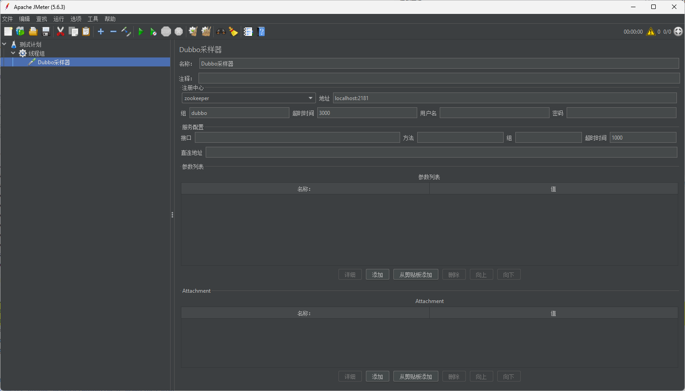

# JMeter Dubbo Plugin

A plugin for Apache JMeter to test Dubbo services.

[](https://jmeter.apache.org/)
[](https://dubbo.apache.org/)
[](https://opensource.org/licenses/Apache-2.0)
[](https://github.com/solsynx/jmeter-dubbo-plugin/actions/workflows/build.yml)

## 代码仓库

[](https://gitee.com/solsynx/jmeter-dubbo-plugin)
[](https://github.com/solsynx/jmeter-dubbo-plugin)
[](https://gitcode.com/solsynx/jmeter-dubbo-plugin)


## 简介

JMeter Dubbo Plugin 是一个用于在 Apache JMeter 中测试 Dubbo 服务的插件。该插件允许用户通过 JMeter GUI 配置 Dubbo 服务调用参数，并收集性能测试数据。

## 功能特性

- 支持泛化调用，无需引入具体的 Dubbo 接口依赖
- 可配置注册中心类型、地址、超时时间、认证信息等
- 可配置服务直连地址、服务组、接口、方法、超时时间等服务信息
- 支持附加参数配置
- 完整的 JMeter 集成，支持在 JMeter GUI 中配置各项参数
- 线程安全的客户端管理
- 国际化支持，提供中英文界面显示
- 详细的调用信息记录，包括提供者实例信息和附件
- 模块化设计，支持动态加载不同注册中心类型

## 效果展示



## 项目结构

本项目采用多模块结构：

- `jmeter-dubbo-core`: 核心功能模块，包含 Dubbo Sampler 和客户端实现
- `jmeter-dubbo-zookeeper`: ZooKeeper 注册中心支持模块，受Zookeeper影响，需要使用Java 8环境

## 安装

### 环境要求

- Java 8 或更高版本
- Apache JMeter 5.6.3 或兼容版本
- Maven 3.6 或更高版本（仅编译时需要）

### 构建项目

使用项目自带的 Maven Wrapper 运行命令：

```bash
# Unix/Linux/macOS
./mvnw clean install

# Windows
.\mvnw.cmd clean install
```

### 安装插件到 JMeter

构建完成后，将生成的 jar 文件复制到 JMeter 的 lib/ext 目录：

```bash
cp jmeter-dubbo-zookeeper/target/jmeter-dubbo-zookeeper-*-with-dependencies.jar $JMETER_HOME/lib/ext/
```

或者在 Maven 构建时会自动将 jar 文件复制到指定的 JMeter 目录（需要在 pom.xml 中配置正确的 JMeter 路径）。

## 使用方法

### GUI 界面配置说明

Dubbo Sampler 在 JMeter GUI 中提供了丰富的配置选项，分为以下几个部分：

#### 注册中心部分

- **类型**: 如 zookeeper、nacos、etcd 等（取决于引入的模块）
- **地址**: 注册中心地址
- **组**: 注册中心组，默认为 dubbo
- **超时时间**: 连接超时时间，默认 1000ms
- **用户名**: 认证用户名（可选）
- **密码**: 认证密码（可选）

#### 服务部分

- **直连地址**: 直接连接服务提供者的 URL（可选）
- **服务组**: 服务所属组
- **接口**: 服务接口全限定名
- **方法**: 调用方法名
- **超时时间**: 服务调用超时时间，默认 1000ms
- **Attachment**: 附加参数，以键值对形式配置
- **参数列表**: 方法参数类型和值，以键值对形式配置

### 示例测试计划

1. 在 JMeter 中添加线程组
2. 在线程组下添加 Dubbo Sampler
3. 配置注册中心和服务参数
4. 添加监听器（如 View Results Tree）查看结果
5. 运行测试

## 扩展支持

### 添加新的注册中心类型

该项目采用模块化设计，支持动态添加新的注册中心类型：

1. 创建新的 Maven 模块
2. 添加对应注册中心的 Dubbo 依赖
3. 实现 `RegistryTypeProvider` 接口
4. 在 `src/main/resources/META-INF/services/` 目录下添加服务配置文件
5. 构建并部署模块

当用户引入相应的模块 jar 包时，新的注册中心类型会自动出现在 GUI 的类型选择列表中。

## 开发指南

1. 确保已安装 Java 8 或更高版本
2. 使用 Maven Wrapper 构建项目
3. 在 IntelliJ IDEA 或 Eclipse 中导入项目

## 许可证

本项目采用 Apache License 2.0 许可证。
